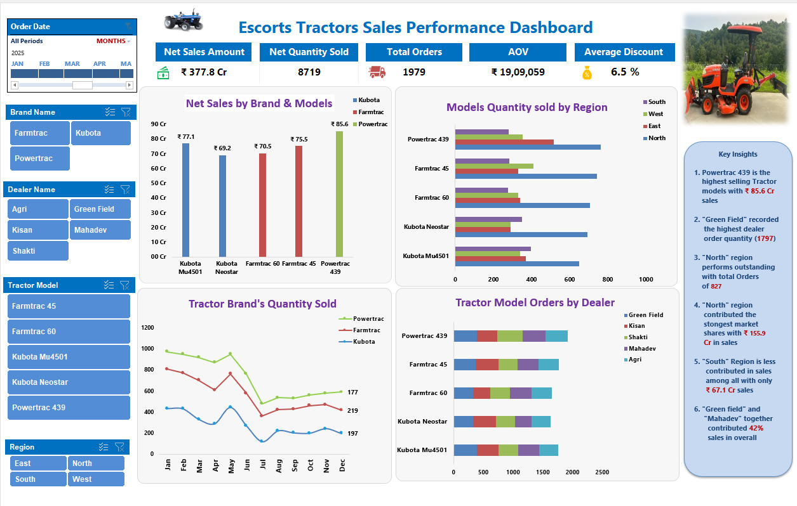
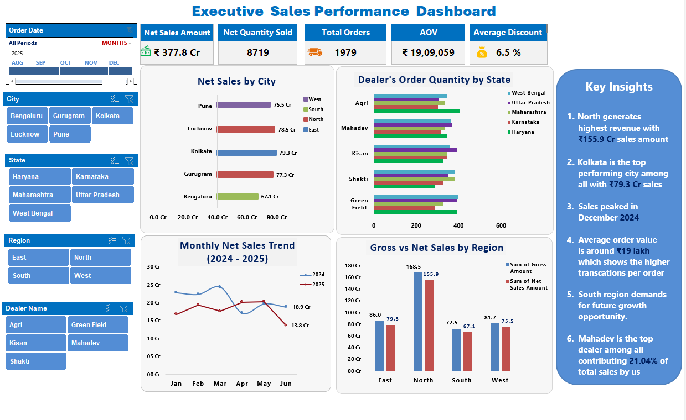

# 🚜 Escorts Kubota Sales MIS Dashboard

An end-to-end **Sales MIS project developed in Microsoft Excel** to clean, organize, analyze, and visualize tractor sales data through interactive reports and dashboards.

## 🎯 Project Objective

The objective of this project was to create a practical Sales MIS system that helps track sales performance across **brands, tractor models, dealers, sales executives, cities, states, and regions** and provides management-level insights through interactive dashboards.

## 📊 Dashboard Preview

### 🚜 Brand Sales Dashboard

### 📈 Executive Sales Dashboard

## 📊 Dataset & Scope

- Approx. 2,000 sales transaction records
- 3 tractor brands: Farmtrac, Powertrac, Kubota
- 5 tractor models
- 5 dealers
- 5 sales executives
- Multiple Indian cities and states
- 4 regions: North, South, East, West
- Order, quantity, pricing, discount and sales-status information
- Payment, delivery and GST status fields

## 🧹 Data Preparation

The raw sales data was cleaned and structured before analysis.

- Removed duplicate Invoice IDs
- Standardized inconsistent text values
- Mapped tractor models with their respective brands
- Mapped cities and states to regions
- Used lookup functions to connect master data with transaction data
- Applied quantity-based discount mapping
- Calculated Gross Amount and Net Sales Amount
- Structured the cleaned data using an Excel Table for reporting

## 🛠️ Excel Skills & Techniques Used

- Advanced Excel
- XLOOKUP
- VLOOKUP
- INDEX-MATCH
- IF / IFS / IFERROR and logical formulas
- Excel Tables & Structured References
- PivotTables
- Pivot Charts
- Slicers
- Timeline
- KPI reporting
- Dashboard design
- Data cleaning
- Data Transformation
- Business analysis

## 📈 MIS Reports & Dashboards

The workbook contains:

- **Executive Sales Report**
- **Brand Sales Report**
- **Executive Sales Dashboard**
- **Brand Sales Dashboard**
- Cleaned transactional data
- Interactive filtering using Slicers and Timeline

The dashboards allow sales performance to be analyzed by **brand, tractor model, dealer, region, state, city and time period**.

## 🔢 Key Project Metrics

- **Net Sales:** **₹377.8 Cr**
- **Quantity Sold:** **8,719 units**
- **Total Orders:** **1,979**
- **Average Order Value:** **₹19.09** Lakh
- **Average Discount:** **6.5%**

## 💡 Key Business Insights

- North region generated the highest regional Net Sales **155.9 Cr**.
- Kolkata recorded the highest city-level Net Sales **79.3 Cr**.
- Powertrac439 is the highest-selling tractor model by sales value **85.6 Cr**.
- South region recorded comparatively lower sales and represents an area for future growth.
- Mahadev is one of the strongest-performing dealer contributing **21.04 %** among all.
- Sales performance varied significantly across regions, dealers and tractor models.

## 📌 Project Outcome

This project demonstrates the ability to take **raw sales data through the complete MIS workflow** — data cleaning, data preparation, calculation, reporting, dashboard creation and business insight generation — using Excel.

The project is designed as a practical portfolio project for **MIS Executive, MIS Analyst, Reporting Analyst and entry-level Data Analyst roles**.
